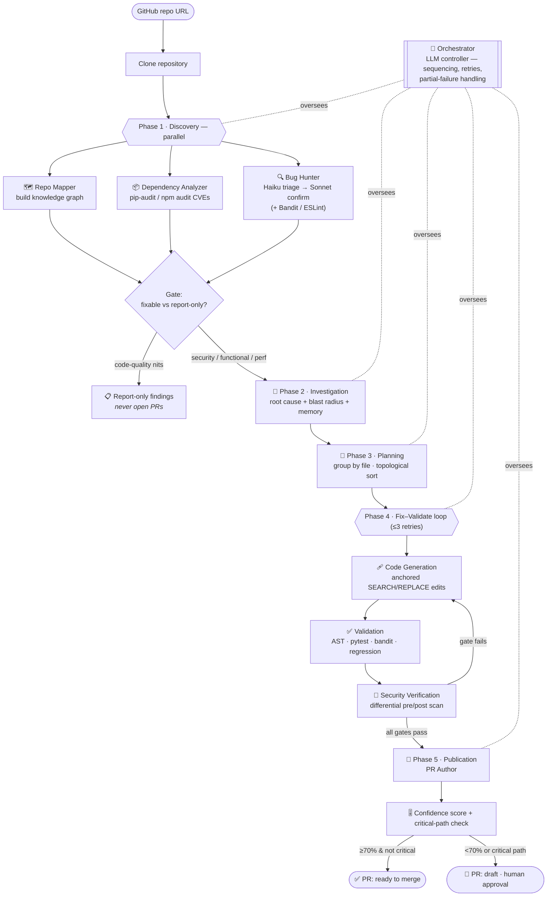
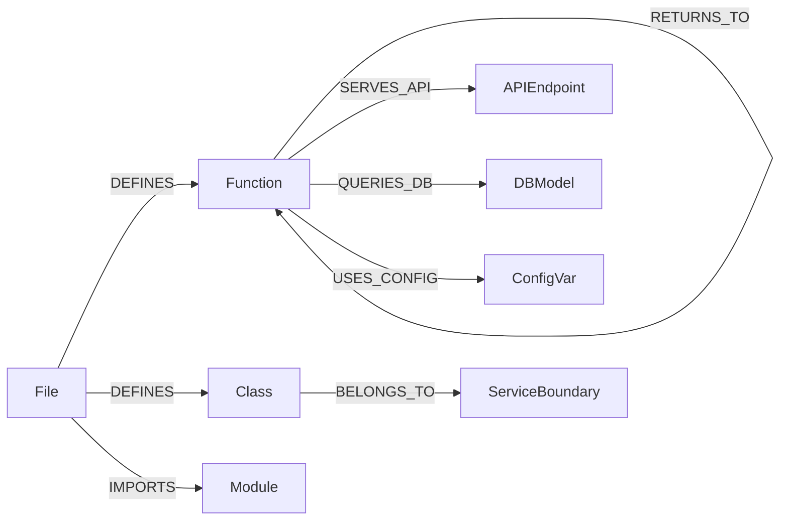

<div align="center">

# 🛠️ Multi-Agent Bug Detection & Auto-PR System

**Autonomous software maintenance via a 10-agent orchestrated pipeline with knowledge-graph-backed cross-file reasoning.**

Point it at a GitHub repository and it builds a semantic knowledge graph, hunts for **real** bugs (functional, security, performance, quality), plans ordered repairs, generates **surgical minimal-diff patches**, validates them, and opens **confidence-scored pull requests** with human-approval gates — all from a single Streamlit app.


</div>

---

## 📑 Table of Contents

- [Why this exists](#-why-this-exists)
- [Key features](#-key-features)
- [Workflow diagram](#-workflow-diagram)
- [The 10 agents & 5 phases](#-the-10-agents--5-phases)
- [Knowledge graph](#-knowledge-graph)
- [Confidence scoring & approval gates](#-confidence-scoring--approval-gates)
- [Tech stack](#-tech-stack)
- [Project structure](#-project-structure)
- [Getting started](#-getting-started)
- [Configuration](#-configuration)
- [Using a third-party LLM proxy](#-using-a-third-party-llm-proxy-lightning-ai-etc)
- [How it works, step by step](#-how-it-works-step-by-step)
- [Limitations](#-limitations)
- [Roadmap](#-roadmap)
- [License](#-license)

---

## 🎯 Why this exists

Existing auto-fix tools (Semgrep Autofix, Patchwork, CodeRabbit) analyse each file **in isolation**. They can't answer the questions a senior engineer asks instinctively:

- *Why* does this bug exist (root cause vs. symptom)?
- *Which* modules does a change affect (blast radius)?
- *What* is the safest order to apply fixes?
- Does the fix *actually work* (tests + no new vulnerabilities)?

This system answers all four by reasoning **across files** on a knowledge graph, and it never ships a patch that hasn't passed validation. It also **won't spam you** — low-value style nits are shown as "report-only" and never become pull requests.

---

## ✨ Key features

| Capability | What it does |
|---|---|
| 🔍 **LLM Bug Hunter** | Two-stage discovery — cheap **Haiku** triages every source file, strong **Sonnet** confirms real defects with cited evidence and a concrete fix. Finds genuine bugs, not just "function is long". |
| 🕸️ **Knowledge graph** | A `networkx` directed graph of files, functions, classes, API endpoints, DB models, imports & calls — the backbone for cross-file reasoning and blast-radius analysis. |
| 🧭 **Cross-file root cause** | 2-hop BFS + data-flow tracing finds where a bug *originates*, not just where the symptom surfaces. |
| 🩹 **Surgical patches** | Anchored `SEARCH/REPLACE` edits change only what they must — **no whole-file rewrites** — and emit a real unified diff. |
| ✅ **Validated fixes** | Four gates: AST syntax → pytest + bandit → regression (blast-radius) → differential security. Nothing ships that fails. |
| 📦 **One PR per file** | All of a file's issues are fixed and shipped together — no flood of near-duplicate PRs. |
| 🎚️ **Confidence scoring** | A 5-signal composite (0–100%) drives auto-merge eligibility vs. mandatory human review. |
| 🚦 **Approval gates** | Critical-path or low-confidence changes are opened as drafts requiring human sign-off. |
| 🧠 **Repository memory** | ChromaDB stores past fixes; similar future bugs get a confidence boost (optional, degrades gracefully). |
| 🫧 **Interactive bubble map** | Explore the repo as a force-directed graph — click any file to light up its blast radius. |

---

## 🔄 Workflow diagram



---

## 🧩 The 10 agents & 5 phases

| # | Agent | Phase | Responsibility |
|---|-------|-------|----------------|
| 1 | **Repo Mapper** | 1 · Discovery | Build the knowledge graph (files, functions, classes, API routes, DB models, imports/calls). |
| 2 | **Dependency Analyzer** | 1 · Discovery | Scan `requirements.txt` / `package.json` for CVE-flagged & outdated packages. |
| 3 | **Bug Hunter** | 1 · Discovery | Two-stage LLM detection (Haiku triage → Sonnet confirm) + Bandit/ESLint; all four issue classes. |
| 4 | **Bug Investigation** | 2 · Investigation | Root cause, severity, blast radius, affected modules; query memory for similar past fixes. |
| 5 | **Repair Planner** | 3 · Planning | Group fixable findings by file; order by dependency (security first) via topological sort. |
| 6 | **Code Generation** | 4 · Fix loop | Produce minimal anchored `SEARCH/REPLACE` edits + a real unified diff. |
| 7 | **Validation Agent** | 4 · Fix loop | AST check → pytest + bandit → regression tests on blast-radius modules. |
| 8 | **Security Verification** | 4 · Fix loop | Differential pre/post scan — original vuln gone, no new ones introduced. |
| 9 | **PR Author** | 5 · Publication | Compute confidence, apply approval gate, open one GitHub PR per file. |
| 10 | **Orchestrator** | all | LLM-based controller: sequencing, retries, escalation, graceful partial-failure handling. |

---

## 🕸️ Knowledge graph

The graph (a `networkx.DiGraph`) is what makes cross-file reasoning possible.



**Blast radius** = the set of nodes reachable within *k* hops (default 2) from a modified file. It drives which tests to run, whether a change is "critical path", and how the interactive bubble map highlights impact.

---

## 🎚️ Confidence scoring & approval gates

Each fix earns a weighted composite score (0–100%):

| Signal | Weight | Meaning |
|--------|--------|---------|
| pytest suite passes | **+40%** | Behaviour is preserved (strongest signal) |
| Post-fix security scan clean | **+25%** | Vulnerability confirmed removed, none introduced |
| AST syntax valid | **+10%** | Generated code is structurally correct |
| Memory cache hit | **+15%** | A similar past fix succeeded before |
| Fixed first (low dependency risk) | **+10%** | Topological-sort priority |

> Repos **without a test suite** are capped at **60%** and always require human approval.

| Confidence | Critical path? | Action |
|-----------|----------------|--------|
| ≥ 70% | No | Open PR **ready to merge** |
| ≥ 70% | Yes | Open **draft** + request approval (auto-merge blocked) |
| < 70% | No | Open **draft** + request approval |
| < 70% | Yes | Open **draft**, mark *requires security review* |

---

## 🧰 Tech stack

| Layer | Technology |
|-------|-----------|
| UI | **Streamlit** (single app, custom dark theme, `vis-network` bubble map) |
| LLM | **Claude** via the Anthropic SDK — Sonnet for reasoning/codegen, Haiku for triage (proxy-aware) |
| Discovery | LLM Bug Hunter + **Bandit** (Python) + **ESLint** (JS/TS) + **pip-audit / npm audit** |
| Knowledge graph | **NetworkX** + Python `ast` |
| Patching | Anchored `SEARCH/REPLACE` diff applier (`difflib`) |
| Test execution | **pytest** in a sandboxed temp copy |
| Memory | **ChromaDB** (optional, persistent, local) |
| Source control | **PyGitHub** + Git |
| Config | **Pydantic Settings** (`.env`-driven) |

---

## 📁 Project structure

```
app/
├── streamlit_app.py            # Streamlit UI — the single entry point
├── .streamlit/config.toml      # theme
├── .env                        # secrets (git-ignored)
├── backend/
│   ├── config.py               # Pydantic settings (env-driven)
│   ├── models.py               # Pydantic data models
│   ├── knowledge_graph.py      # networkx graph, blast radius, data-flow tracing
│   ├── requirements.txt
│   ├── agents/
│   │   ├── orchestrator.py         # drives the 5-phase pipeline
│   │   ├── repo_mapper.py          # Phase 1 — knowledge graph
│   │   ├── dependency_analyzer.py  # Phase 1 — CVE scan
│   │   ├── static_analysis.py      # Phase 1 — bandit + eslint
│   │   ├── llm_bug_hunter.py       # Phase 1 — Haiku triage → Sonnet confirm
│   │   ├── bug_investigation.py    # Phase 2 — root cause + blast radius
│   │   ├── repair_planner.py       # Phase 3 — group by file + topo-sort
│   │   ├── code_generation.py      # Phase 4 — anchored diffs
│   │   ├── validation_agent.py     # Phase 4 — AST + pytest + bandit
│   │   ├── security_verification.py# Phase 4 — differential scan
│   │   └── pr_author.py            # Phase 5 — one PR per file
│   └── utils/
│       ├── patcher.py              # SEARCH/REPLACE parser + applier + unified diff
│       ├── llm_client.py           # Anthropic client (base-URL / proxy aware)
│       ├── confidence_scorer.py    # 5-signal composite
│       ├── critical_path.py        # auth/crypto/security path detection
│       ├── github_client.py        # clone, branch, commit, PR
│       └── chroma_memory.py        # optional repository memory
```

---

## 🚀 Getting started

### Prerequisites
- **Python 3.11**
- **Git** on your PATH
- An **Anthropic API key** (or a compatible proxy — see below)
- *(optional)* a **GitHub token** to clone private repos / open real PRs

### Install
```bash
git clone https://github.com/<you>/<repo>.git
cd <repo>            # the folder containing streamlit_app.py
python -m venv venv
# Windows:  venv\Scripts\activate      macOS/Linux:  source venv/bin/activate
pip install -r backend/requirements.txt
```

### Configure
Create a `.env` file next to `streamlit_app.py`:
```dotenv
ANTHROPIC_API_KEY=sk-ant-...
GITHUB_TOKEN=ghp_...            # optional
# CLAUDE_MODEL_PRIMARY=claude-sonnet-4-6
# CLAUDE_MODEL_TRIAGE=claude-haiku-4-5-20251001
```

### Run
```bash
streamlit run streamlit_app.py
```
Open http://localhost:8501, paste a repository URL, and click **🫧 Build Repo Map** (no key needed) or **▶️ Run Pipeline**.

> Some deep-analysis steps shell out to external CLIs (`bandit`, `pytest`, `eslint`, `pip-audit`). Install the ones you need; the app runs without them and simply skips those checks.

---

## ⚙️ Configuration

All settings live in `backend/config.py` and can be overridden via `.env` / environment variables.

| Key | Default | Purpose |
|-----|---------|---------|
| `ANTHROPIC_API_KEY` | — | Required. Claude API key. |
| `ANTHROPIC_BASE_URL` | *(unset)* | Point at a compatible proxy instead of `api.anthropic.com`. |
| `GITHUB_TOKEN` | *(unset)* | Clone private repos / open PRs. |
| `CLAUDE_MODEL_PRIMARY` | `claude-sonnet-4-6` | Reasoning / confirmation / code-gen model. |
| `CLAUDE_MODEL_TRIAGE` | `claude-haiku-4-5-20251001` | Cheap triage model. |
| `LLM_USE_TEMPERATURE` | `false` | Some newer models reject `temperature`; keep off for those. |
| `bug_hunter_max_files` | `0` (no cap) | Cap the number of files the hunter analyses. |
| `bug_hunter_delay_seconds` | `1.0` | Pause between files to respect rate limits. |
| `fix_code_quality` | `false` | If `true`, code-quality nits are also fixed (not just reported). |
| `min_severity_to_fix` | `low` | Only PR issues at/above this severity. |
| `max_files_to_fix` | `0` (no cap) | Cap the number of PRs per run. |
| `blast_radius_default_hops` | `2` | k-hop reachability for blast radius. |
| `confidence_threshold_auto_merge` | `0.70` | Below this ⇒ draft + approval. |

---

## 🔌 Using a third-party LLM proxy (Lightning AI, etc.)

The app talks to the LLM through the Anthropic SDK, so any Anthropic-compatible endpoint works. Set the base URL, key, and model(s) in `.env`:

```dotenv
ANTHROPIC_BASE_URL=https://your-proxy.example.com/
ANTHROPIC_API_KEY=<proxy-key>
CLAUDE_MODEL_PRIMARY=claude-opus-4-8
CLAUDE_MODEL_TRIAGE=claude-opus-4-8
LLM_USE_TEMPERATURE=false
```

The Streamlit app loads `.env` into the environment at startup, so no keys need to be re-typed in the UI.

---

## 🧠 How it works, step by step

1. **Clone** the target repo into a temp directory.
2. **Discovery (parallel):** the Repo Mapper builds the knowledge graph; the Dependency Analyzer scans for CVEs; the Bug Hunter triages every file with Haiku and confirms real defects with Sonnet.
3. **Gate:** findings split into **fixable** (security / functional / performance) and **report-only** (code-quality nits — shown in the UI, never PR'd).
4. **Investigation:** each fixable finding gets a root cause, blast radius, affected modules, and a memory lookup.
5. **Planning:** findings are grouped by file and topologically ordered (security first).
6. **Fix–Validate loop:** Code Gen produces minimal anchored edits → Validation (AST + pytest + bandit + regression) → Security Verification (differential scan). On failure, the errors are fed back and it retries (≤3).
7. **Publication:** for each validated file, PR Author computes the confidence score, applies the critical-path/approval gate, and opens **one pull request per file** with a structured description, confidence badge, blast-radius summary, and the unified diff.

Throughout, the **Orchestrator** streams every agent event live to the Streamlit feed and handles partial failures without aborting the run.

---

## ⚠️ Limitations

- **Language support:** optimised for **Python** (AST, pytest, bandit); **JS/TS** is secondary (ESLint, npm audit). Java/Go/Rust would need extra parsers.
- **Tests required for high confidence:** without a test suite, confidence is capped at 60% and every PR needs human approval.
- **Dynamic code:** heavy runtime magic (monkey-patching, metaclass factories) is conservatively over-approximated rather than fully resolved.
- **Cost:** scanning every file with an LLM has a token cost; use `bug_hunter_max_files` / `min_severity_to_fix` to bound it.

---

## 🗺️ Roadmap

- Sandboxed Docker execution for full CI parity
- Auto-merge for confidence ≥ 95% on non-critical paths
- Multi-repository / org-level scanning with shared memory
- 3D force-directed upgrade of the bubble map
- Full Java / Go / Rust support

---

## 📄 License

Released under the **MIT License**. See [`LICENSE`](LICENSE).

<div align="center">
<sub>Built with Claude · NetworkX · Streamlit</sub>
</div>
